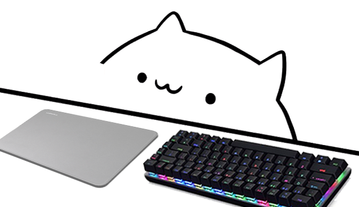

<div align="center">
  
  <h1>Bongo Cat for Linux - Forked by LukasYT</h1>
  <p>An osu! Bongo Cat overlay with smooth paw movement, natively ported to Linux with <strong>Wayland support</strong>, a built-in <strong>GUI Launcher</strong>, and the awesome <strong>Any Key</strong> feature!</p>
</div>

---

## ✨ New Features in this Fork
This is a heavily modified and improved fork by **LukasYT** based on the original project. We have added many Quality of Life features specifically for Linux users:

- **AppImage Support**: No more compiling! Just download, double click, and run.
- **GUI Launcher**: An elegant graphical interface to select your game mode, toggle the Any Key feature, and enable Green Screen without touching any configuration files.
- **Green Screen Mode**: Easily toggle a pure green background (`#00FF00`) directly from the launcher. Perfect for using **Chroma Key in OBS Studio** to stream osu! or other games.
- **Wayland Native**: Seamlessly tracks your mouse and keyboard across your entire desktop, even under Wayland.
- **Automatic Privilege Escalation**: If direct input access is missing, Bongo Cat will safely and elegantly prompt for your password via a graphical Polkit interface, or seamlessly fall back to X11 mode (perfect for osu! running under Wine).

## 🚀 How to Run

### 1. The Easy Way (AppImage)
Simply download the `BongoCat-x86_64.AppImage` from the [Releases](https://github.com/LukasYTTT/Bongobs-Cat-Plugin/releases) page.
1. Make it executable: `chmod +x BongoCat-x86_64.AppImage`
2. Double click it (or run `./BongoCat-x86_64.AppImage` in the terminal).
3. Select your mode in the GUI Launcher and click "Start"!

### 2. Custom Backgrounds
Want to put your own background behind the cat? 
1. Use the **Green Screen** checkbox in the launcher and use a Chroma Key filter in OBS.
2. OR manually replace the background images! Just go into the `img/` folder (e.g., `img/osu/mousebg.png`) and replace the image with your own custom background.

## ⚙️ Building from Source
If you want to compile it yourself:

### Dependencies (Linux)
You need to have these dependencies installed (check your package manager):
- `g++`
- `libxdo-dev` (or `xdotool`)
- `libsdl2-dev`
- `libsfml-dev`
- `libx11-dev`

### Compiling
```sh
make
```
You can then run the compiled binary:
```sh
./bin/bongo
```

---
*Original project by [HamishDuncanson](https://github.com/HamishDuncanson) and Linux port by [CSaratakij](https://github.com/CSaratakij). Forked and maintained by LukasYT.*
